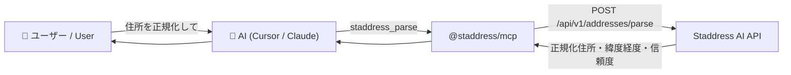

<p align="center">
  
</p>

# @staddress/mcp

[](https://www.npmjs.com/package/@staddress/mcp)
[](https://github.com/StaddressAI/staddress-tools/actions/workflows/smoke.yml)
[](../../LICENSE)

Staddress AI 住所解析 API を [Model Context Protocol (MCP)](https://modelcontextprotocol.io) のツールとして公開するサーバ。Cursor / Claude Desktop / ChatGPT などの MCP 対応クライアントから、住所の正規化・分解をツールとして呼び出せます。



## ワンクリック導入

[](cursor://anysphere.cursor-deeplink/mcp/install?name=staddress&config=eyJjb21tYW5kIjoibnB4IiwiYXJncyI6WyIteSIsIkBzdGFkZHJlc3MvbWNwIl0sImVudiI6eyJTVEFERFJFU1NfQVBJX0tFWSI6IiJ9fQ==)
[](vscode:mcp/install?%7B%22name%22%3A%22staddress%22%2C%22command%22%3A%22npx%22%2C%22args%22%3A%5B%22-y%22%2C%22%40staddress%2Fmcp%22%5D%2C%22env%22%3A%7B%22STADDRESS_API_KEY%22%3A%22%24%7Binput%3Astaddress_api_key%7D%22%7D%7D)

### Claude Desktop Extension（.mcpb）

Claude Desktop では、設定ファイルを手で書かずに導入できます。

1. [最新の `staddress.mcpb`](https://github.com/StaddressAI/staddress-tools/releases/latest/download/staddress.mcpb) をダウンロードする（`mcp-v*` タグの GitHub Release に添付されます）。
2. ファイルをダブルクリックするか、Claude Desktop の **Settings → Extensions** にドラッグする。
3. **Install** を押し、`Staddress API Key` に公式サイトで発行したキーを入れる。
4. **Extensions のスイッチを On** にする（API キー未入力だと自動では有効になりません）。Claude Desktop を **Cmd+Q** で終了して再起動し、**新しいチャット**で使ってください。

ローカルで梱包する場合:

```bash
cd packages/mcp
npm install
npm run mcpb:pack   # 同ディレクトリに staddress.mcpb を生成
```

> Cursor / VS Code のボタンで追加した後は、`STADDRESS_API_KEY` に自分の API キーを設定してください（Cursor は `~/.cursor/mcp.json` の鉛筆アイコンから編集できます）。

## 提供ツール

| ツール | 対応 API | 説明 |
| --- | --- | --- |
| `staddress_parse` | `POST /api/v1/addresses/parse` | 単件の住所を正規化・分解 |
| `staddress_parse_batch` | `POST /api/v1/addresses/parse/batch` | 複数住所を一括解析（Standard プラン以上、最大100件） |
| `staddress_get_usage` | `GET /api/v1/usage` | 利用状況（プラン・件数・クレジット）を取得 |

いずれも読み取り専用（`readOnlyHint`）です。

## Remote MCP（Streamable HTTP）

公開 URL が必要なクライアント（Smithery / Claude.ai Custom Connector / ChatGPT）向けに、同じツールを HTTP でも出せます。

```bash
npx -y @staddress/mcp --http
# または
STADDRESS_MCP_TRANSPORT=http PORT=8787 npx -y @staddress/mcp
```

| パス | 説明 |
| --- | --- |
| `POST /mcp` | Streamable HTTP（要 `X-Api-Key` または `Authorization: Bearer`） |
| `GET /health` | ヘルスチェック |
| `GET /.well-known/mcp/server-card.json` | Smithery 等向けの静的サーバカード |

キー無しの `/mcp` は **401** を返します（403 にはしません）。

Docker:

```bash
cd packages/mcp
npm ci && npm run build
docker build -t staddress-mcp .
docker run --rm -p 8787:8787 staddress-mcp
```

Smithery の「MCP Server URL」には、デプロイ後の `https://<host>/mcp` を入れてください。stdio / `.mcpb` ではこの欄は使えません。

## 前提

- Node.js 18 以上
- Staddress AI の API キー（stdio は環境変数 `STADDRESS_API_KEY`、HTTP はリクエストヘッダ）

## クライアント設定

### Cursor

`~/.cursor/mcp.json`（プロジェクト単位なら `.cursor/mcp.json`）に追加します。

```json
{
  "mcpServers": {
    "staddress": {
      "command": "npx",
      "args": ["-y", "@staddress/mcp"],
      "env": {
        "STADDRESS_API_KEY": "sk_xxx"
      }
    }
  }
}
```

### Claude Desktop（手動 JSON）

ワンクリック導入は上の [Claude Desktop Extension](#claude-desktop-extensionmcpb) を推奨します。手動で入れる場合は `claude_desktop_config.json` に追加します。

```json
{
  "mcpServers": {
    "staddress": {
      "command": "npx",
      "args": ["-y", "@staddress/mcp"],
      "env": {
        "STADDRESS_API_KEY": "sk_xxx"
      }
    }
  }
}
```

自前 API エンドポイントを使う場合は `env` に `STADDRESS_BASE_URL` を追加してください（既定: `https://api.staddress.com`）。

## 動作確認（MCP Inspector）

```bash
STADDRESS_API_KEY=sk_xxx npx @modelcontextprotocol/inspector npx -y @staddress/mcp
```

## 使い方の例（AI への指示）

チャットにこう入力するだけで、AI が自動的に `staddress_parse` を呼び出します。

> 「`東京都渋谷区道玄坂1-2 マンション桜 101号` を staddress で正規化して、緯度経度も教えて」

**入力（表記ゆれ・番地混在）:**

```text
東京都渋谷区道玄坂1-2 マンション桜 101号
```

**AI が受け取るツールの戻り値（`staddress_parse`）:**

```json
{
  "result": {
    "normalized": "東京都渋谷区道玄坂一丁目2 マンション桜 101号",
    "standard": "東京都渋谷区道玄坂1-2",
    "components": {
      "pref": "東京都",
      "prefCode": "13",
      "city": "渋谷区",
      "cityCode": "13113",
      "oazaCho": "道玄坂",
      "chomeNumber": "1",
      "streetNumberBlock": "2",
      "buildingName": "マンション桜",
      "roomNumber": "101",
      "roomNumberUnit": "号",
      "lat": 35.658034,
      "lon": 139.699475,
      "lgCode": "131130"
    },
    "confidence": {
      "score": 0.98,
      "matchLevel": "residential_block",
      "query": "東京都渋谷区道玄坂1-2 マンション桜 101号"
    }
  }
}
```

正規化住所・都道府県／市区町村コード・建物名・部屋番号・緯度経度・信頼度（`score` / `matchLevel`）まで、構造化データとして返ります。CSV 一括処理には `staddress_parse_batch` を使います。

> 実行画面の GIF / スクリーンショットは近日追加予定です。

## エラー時の挙動

API エラー・ネットワークエラー・APIキー未設定は、ツール結果を `isError: true` として返し、`code` / `http_status` / `request_id` を含む説明テキストを添えます（サーバは落ちません）。

## 開発

```bash
cd packages/mcp
npm install
npm run typecheck
npm test          # vitest（ツールハンドラの単体テスト、実 API 不要）
npm run build         # dist/index.js（stdio 実行ファイル）を生成
npm run start:http    # Streamable HTTP（既定 http://0.0.0.0:8787/mcp）
npm run mcpb:validate # Claude Desktop Extension の manifest.json を検証
npm run mcpb:pack     # staddress.mcpb を梱包（依存を server/index.js に同梱）
```

内部では公式 Node.js SDK [`@staddress/client`](../node/) を利用しています。

## レジストリ掲載（露出向上）

MCP ディレクトリに掲載されると継続的な流入が見込めます。

- **Smithery**: Web 申請（[smithery.ai/servers/new](https://smithery.ai/servers/new)）は **公開 HTTPS の Streamable HTTP URL**（`https://<host>/mcp`）が必要。ローカル確認は `npx @staddress/mcp --http`。本番 URL をデプロイしてから Continue する。
- **mcp.so**: 申請済み（[chatmcp/mcpso#3686](https://github.com/chatmcp/mcpso/issues/3686)）。審査後に一覧へ反映。
- **Cursor Directory**: [cursor.com/directory](https://cursor.com/directory) の MCP 一覧に申請。
- **Claude Desktop Extensions**: `staddress.mcpb` を GitHub Release に添付。公式ディレクトリ掲載は [Desktop Extension 申請フォーム](https://clau.de/desktop-extention-submission)（手元インストールとは別審査）。
- **公式 MCP レジストリ**: [registry.modelcontextprotocol.io](https://registry.modelcontextprotocol.io)（`mcp-publisher` CLI で公開）。

詳細: [docs/plan-tools.md §5](../../docs/plan-tools.md)

## Privacy Policy

本 MCP サーバー / Claude Desktop Extension は、ユーザーがツールに渡した**住所文字列**と API キーを、Staddress AI API（既定: `https://api.staddress.com`）へ送信します。解析結果（正規化住所・構成要素・緯度経度・信頼度など）をツール応答として返します。

- **収集:** ツール引数の住所（および任意の郵便番号）。API キーは Claude Desktop が OS の秘密領域に保存し、拡張本体はディスクに書きません。
- **利用:** 住所解析 API の呼び出しにのみ使用します。
- **第三者提供:** リクエストは Staddress AI の運営会社（Japan Computer Business Consulting CO., LTD）が提供する API に送信されます。
- **保管:** 本パッケージは住所をローカル永続化しません。API 側の保管・削除は下記ポリシーに従います。
- **連絡先:** [お問い合わせ](https://www.staddress.com/contact) / [運営会社](https://www.jcbc.co.jp/ja)

正式な取り扱いは次を参照してください。

- [Staddress AI プライバシーポリシー](https://www.staddress.com/privacy)
- [運営会社プライバシーポリシー](https://www.jcbc.co.jp/privacy-policy)
